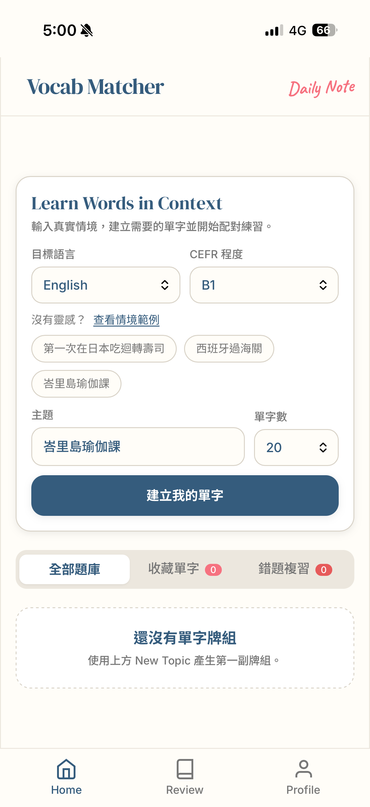
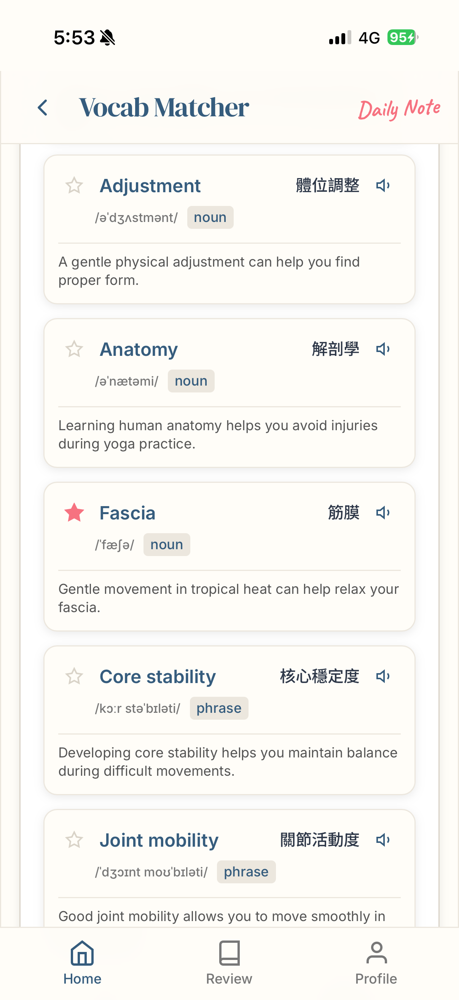
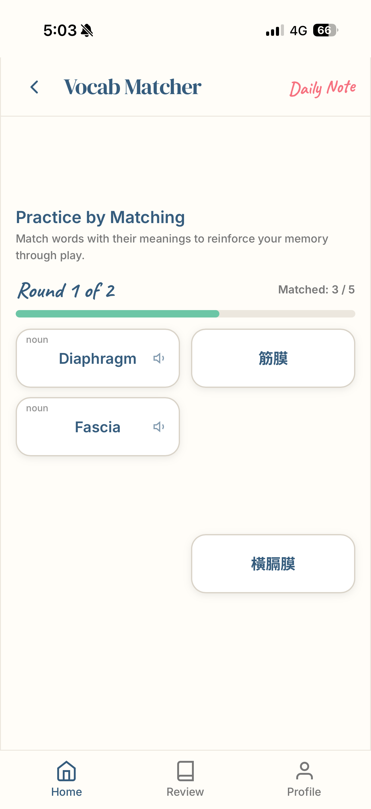

# Vocab Matcher

> 將真實情境轉換成可以立即練習的專屬單字內容。

Vocab Matcher 是一款情境式單字學習 Web App。

輸入即將遇到的情境，例如「第一次在日本吃迴轉壽司」、「去泰國上網球課」或「參加德國珠寶拍賣」，系統就會建立相關單字與例句，並轉換成配對練習。

[Live Demo](https://yoga-vocab.vercel.app/) · [GitHub Repository](https://github.com/chianingho/yoga-vocab)



---

## Why I Built This

這個專案起源於我需要參加一堂全英文的人體學課程。

課程中有大量陌生的專有名詞，但單純死背很痛苦。我很喜歡 Duolingo 的配對遊戲，因此開始思考：

> 能不能做一個專屬於人體學內容的單字配對遊戲？

最初，Vocab Matcher 只為了解決我自己的學習需求。

後來我發現身邊的人也有類似問題，例如準備韓文檢定、去泰國上網球課，或參加德國珠寶拍賣。每個人需要的內容都不同，現成教材很難剛好涵蓋下一個真實情境。

因此，產品逐漸從人體學配對遊戲，發展成可以依照任何情境建立學習內容的工具。

---

## How It Works

### 1. 輸入情境

選擇目標語言、CEFR 程度與單字數量，再輸入即將遇到的真實情境。

目前支援：

* English
* Japanese
* Korean
* Thai
* Indonesian

### 2. 建立單字內容

系統會依照情境產生：

* 目標語言單字或片語
* 簡短繁體中文翻譯
* 音標或讀音
* 詞性
* 原文例句
* 發音功能

### 3. 預覽與收藏

使用者可以先查看生成內容、播放發音，並收藏重要單字。

### 4. 配對練習

將目標語言單字與中文意思配對，錯誤紀錄會保留下來，供後續複習使用。





---

## Key Features

* Context-based vocabulary generation
* CEFR level selection
* Multiple target languages
* Vocabulary preview
* Pronunciation
* Favorites
* Matching game
* Wrong-answer tracking
* Smart review
* Topic management
* PWA support
* Local learning history

---

## AI-Assisted Content Generation

Vocab Matcher 使用 Gemini，根據使用者輸入的情境、語言、程度與單字數量建立學習內容。

為了避免 AI 回傳過長翻譯、不完整例句或錯誤欄位，系統加入三層控制：

1. **Prompt contract**：明確定義每個欄位的用途。
2. **Response schema**：要求模型回傳固定的結構化資料。
3. **Normalization and validation**：在資料進入 Preview、Match 與 localStorage 前進行清理和驗證。

例如，中文 `meaning` 必須是適合配對使用的短翻譯：

```text
reservation → 預約
boarding pass → 登機證
receipt → 收據
```

而不是完整的字典定義或使用說明。

---

## Architecture

```text
Browser
├── HTML / JavaScript
├── Tailwind CSS
├── Web Speech API
└── localStorage
        │
        │ POST /api/generate
        ▼
Vercel Function
├── Prompt construction
├── Response schema
├── Validation
└── API key protection
        │
        ▼
Google Gemini
        │
        ▼
Normalize and render
├── Preview
├── Match
└── Review
```

Gemini API key 儲存在 Vercel 的伺服器端環境變數中，不會傳送到瀏覽器。

---

## Tech Stack

| Area          | Technology                       |
| ------------- | -------------------------------- |
| Frontend      | HTML, JavaScript                 |
| Styling       | Tailwind CSS                     |
| AI            | Google Gemini                    |
| SDK           | Google Gen AI SDK                |
| Backend       | Vercel Functions                 |
| Storage       | Browser localStorage             |
| Pronunciation | Web Speech API                   |
| Deployment    | Vercel                           |
| Analytics     | Vercel Analytics                 |
| Performance   | Vercel Speed Insights            |
| PWA           | Web App Manifest, Service Worker |

---

## Local Setup

### Prerequisites

* Node.js
* Gemini API key
* Vercel CLI，或使用 `npx vercel`

### Installation

```bash
git clone https://github.com/chianingho/yoga-vocab.git
cd yoga-vocab
npm install
```

建立 `.env.local`：

```env
GEMINI_API_KEY=your_gemini_api_key_here
```

啟動本機環境：

```bash
npx vercel dev
```

請勿將 `.env.local` 或正式 API key 提交至 GitHub。

---

## Current Status

目前 MVP 已完成，並進入 Product Validation 階段。

目前主要驗證：

* 新使用者是否能立即理解怎麼開始
* 不同真實情境的生成品質
* AI 回傳內容是否穩定
* Match 是否有助於記憶
* 使用者是否會再次回來建立新情境

---

## Known Limitations

* 學習資料目前只儲存在瀏覽器 localStorage
* 資料不會跨裝置同步
* 清除瀏覽器資料可能移除學習紀錄
* 目前沒有帳號或雲端備份
* AI 生成內容仍可能需要人工確認
* 發音效果取決於瀏覽器與裝置語音

---

## Roadmap

* 第一輪使用者測試
* 改善生成內容品質
* 優化 Smart Review
* 建立更完整的 spaced repetition
* 學習資料匯出
* 可選的帳號與跨裝置同步

---

## Case Study

完整的產品起點、設計決策、AI 輸出可靠性處理與開發反思，請見：

[`docs/CASE_STUDY.md`](docs/CASE_STUDY.md)

---

## License

This project is licensed under the MIT License.
