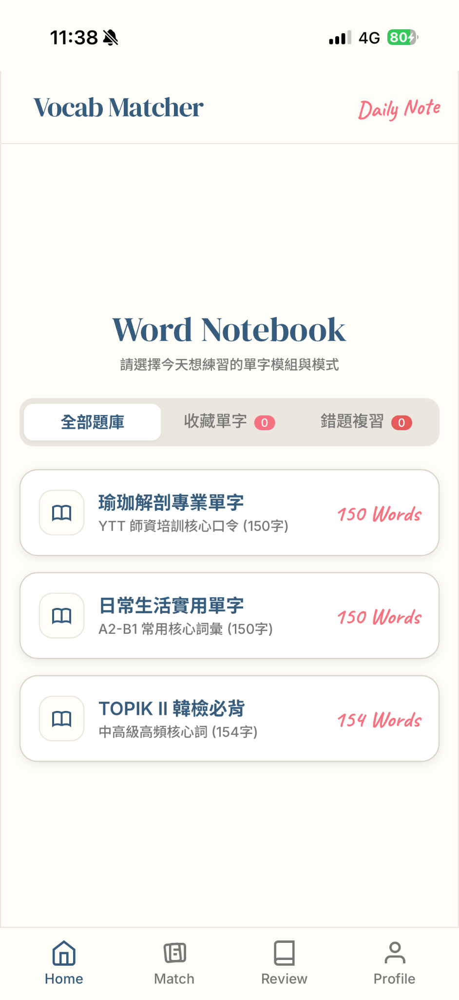
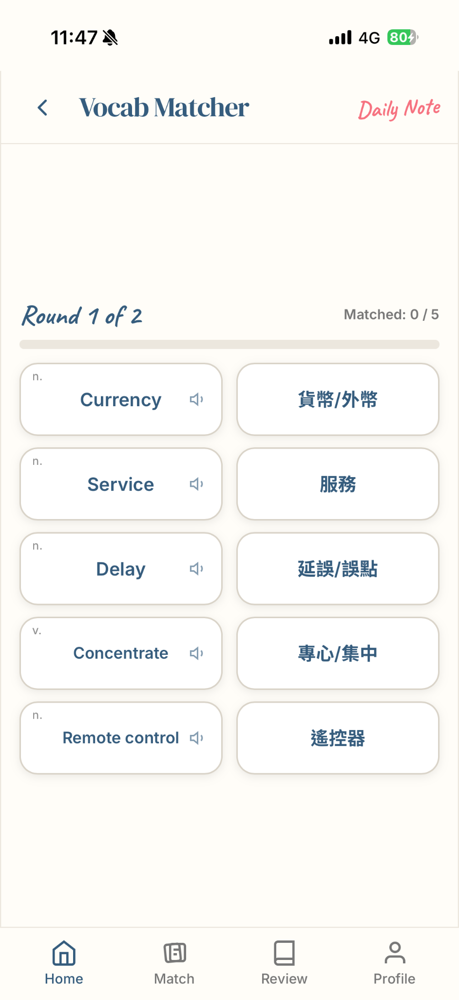
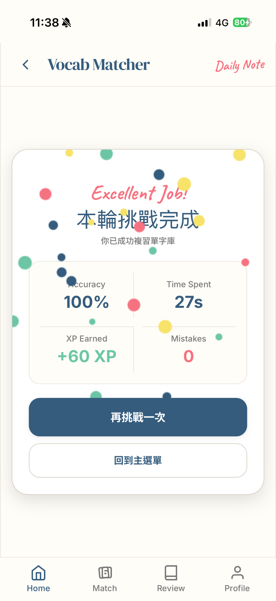

# Vocab Matcher 單字配對樂

> 一個可以換題庫的自學測驗小遊戲。

[](https://yoga-vocab.vercel.app/)
[](LICENSE)

**[👉 線上體驗 Vocab Matcher](https://yoga-vocab.vercel.app/)**（內含 TOPIK II 韓檢 + 瑜珈解剖與日常生活英文兩套題庫）

## 畫面預覽

| 筆記本主選單 | 0-Scroll 滿版配對 | 慶祝通關結算卡 |
| :---: | :---: | :---: |
|  |  |  |

> **提示**：手機瀏覽器開啟後點擊「加入主畫面」，即可作為獨立 PWA / App 形式執行，支援雙款極簡 Icon 切換。

## 這是什麼 / 為什麼做

這個專案最初是我為了準備 TOPIK II 韓檢與峇里島培訓（YTT）而開發的自主學習工具。

在背單字過程中，我發現市面上的單字卡 App 介面往往無法針對需求對陣下藥。我需要的是一個垂直的單字學習、支援真人發音、能先預習／替換單字，且卡片能完全容納於手機單頁螢幕（Zero-Scroll 免往下滑動）的刷題工具。寫完之後發現，只要抽換內建的單字資料庫，就能瞬間變成任何語言或學科的配對小遊戲。

## 做一份自己的

只要簡單 3 個步驟，你就能擁有屬於自己的專屬單字配對 App：

1. **Fork 本儲存庫**：點擊右上角的 Fork 按鈕複製一份至你的 GitHub。
2. **修改題庫資料**：開啟 `index.html` 中的 `database` 物件，替換成你自己的單字、IPA、詞性與例句。
3. **部署上線**：登入 [Vercel](https://vercel.com)，匯入剛剛 Fork 的 Repo，點擊 **Deploy** 即刻秒級上線！

### 題目格式範例（可照抄）

```json
[
  {
    "word": "Spine",
    "ipa": "/spaɪn/",
    "pos": "n.",
    "meaning": "脊椎",
    "example": "Lengthen your spine as you inhale."
  },
  {
    "word": "Vertebrae",
    "ipa": "/ˈvɜːrtɪbriː/",
    "pos": "n.",
    "meaning": "脊椎骨",
    "example": "Stack your vertebrae one by one."
  },
  {
    "word": "Engage",
    "ipa": "/ɪnˈɡeɪdʒ/",
    "pos": "v.",
    "meaning": "啟動肌肉",
    "example": "Engage your core to maintain balance."
  }
]
```

## 題庫格式說明

| 欄位名稱 | 型態 | 必填 | 說明 |
| --- | --- | :---: | --- |
| `word` | String | ✅ | 正面主要語言（顯示於 Word Card 與預習卡，點擊朗讀） |
| `meaning` | String | ✅ | 背面對應翻譯（顯示於 Meaning Card，用於配對驗證） |
| `ipa` | String | — | 音標或發音標註（顯示於預習卡與複習圖書館） |
| `pos` | String | — | 詞性標籤（如 n., v., adj., 名, 動） |
| `example` | String | — | 實用情境例句 |

## 本機開發

本專案採零依賴（Zero-dependency）純前端架構，無需安裝 Node.js 或任何建置套件。

```bash
git clone https://github.com/your-username/vocab-matcher.git
cd vocab-matcher
# 直接使用瀏覽器開啟 index.html 即可開始開發！
```

## 技術棧

HTML5 · Tailwind CSS (CDN) · Vanilla JavaScript · Web Speech API · Web Audio API · HTML5 Canvas · Google Fonts

## License

[MIT License](LICENSE)
